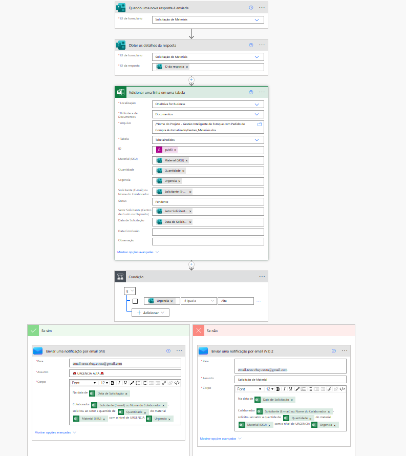

# 🚀 Smart Request Tracker
### Sistema de Gestão de Solicitações (BI + RPA)

Uma solução corporativa para automatizar o recebimento, aprovação e análise de pedidos de materiais, eliminando planilhas manuais e descentralizadas.

---

## 📸 Visão Geral do Fluxo

O processo é 100% automatizado via **Power Automate**. Abaixo está o desenho técnico da automação:

---

## 🛠️ Tecnologias

| Ferramenta | Função no Projeto |
| :--- | :--- |
| **Microsoft Forms** | Formulário de entrada de dados (Front-end). |
| **Power Automate** | Robô que processa o pedido e envia e-mails (Backend). |
| **Excel Online** | Banco de dados em nuvem (armazenado no OneDrive). |
| **Power BI** | Dashboard para análise de indicadores e SLAs. |

---

## ⚙️ Como Funciona (Passo a Passo)

1. **Solicitação:** O usuário preenche o formulário no Microsoft Forms.
2. **Registro:** O Power Automate captura a resposta e adiciona uma linha na tabela do Excel.
3. **Notificação:**
   - O Gestor recebe um e-mail com os detalhes para ciência/aprovação.
   - O Solicitante recebe um e-mail de confirmação de recebimento.
4. **Análise:** O Power BI lê o Excel e atualiza os gráficos de volumetria e status.

---

## 🚀 Como Configurar

1. **Excel:** Crie uma planilha no OneDrive com uma tabela contendo as colunas: `ID`, `Data`, `Solicitante`, `Material`, `Status`.
2. **Automate:** Importe o fluxo e reconecte a ação "Adicionar linha na tabela" apontando para o seu arquivo Excel.
3. **Power BI:** Abra o arquivo `.pbix` e altere a fonte de dados para o seu Excel no OneDrive.

---

    Projeto ainda está em desenvolvimento. 10/12/2025.

